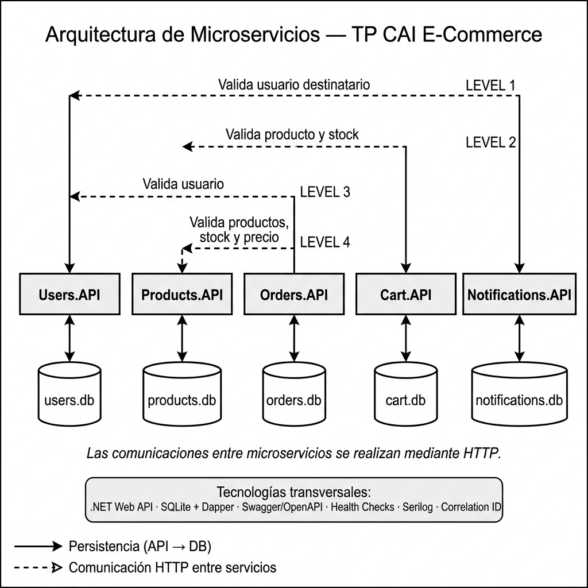

# ECommerce

Solucion migrada desde un WebAPI monolitico hacia cinco microservicios WebAPI independientes en .NET 9.

## Estructura

```text
ECommerce.sln
src/
  Products.API/
  Users.API/
  Orders.API/
  Cart.API/
  Notifications.API/
docs/
README.md
```

Cada microservicio contiene:

```text
Controllers/
Models/
DTOs/
  Requests/
  Responses/
Services/
Exceptions/
ExceptionHandlers/
logs/
Program.cs
appsettings.json
appsettings.Development.json
```

## Uso local

El proyecto apunta a .NET 9. Si no tenes el SDK instalado en macOS:

```bash
curl -fsSL https://dot.net/v1/dotnet-install.sh -o /tmp/dotnet-install.sh
bash /tmp/dotnet-install.sh --channel 9.0 --install-dir "$HOME/.dotnet" --architecture arm64
```

Comandos utiles:

```bash
./project.sh restore
./project.sh build
./project.sh run Products.API
./project.sh run Users.API
./project.sh run Orders.API
./project.sh run Cart.API
./project.sh run Notifications.API
```

## Correr todas las APIs

```bash
./project.sh
```

Este comando compila la solucion y levanta las cinco APIs independientes en conjunto para facilitar el testing y las demos. No las unifica en una sola API. Presiona `Ctrl+C` para detener todos los procesos.

Tambien se puede usar `dotnet` directamente:

```bash
dotnet restore ECommerce.sln
dotnet build ECommerce.sln
dotnet run --project src/Products.API/Products.API.csproj
dotnet run --project src/Users.API/Users.API.csproj
dotnet run --project src/Orders.API/Orders.API.csproj
dotnet run --project src/Cart.API/Cart.API.csproj
dotnet run --project src/Notifications.API/Notifications.API.csproj
```

## Migracion

El WebAPI monolitico original solo contenia el endpoint de ejemplo `weatherforecast`; no habia codigo de dominio para mover. Por eso la migracion realizada es estructural y no agrega logica de negocio nueva.

Mapa previsto para futuros archivos de dominio:

```text
Productos       -> src/Products.API/
Usuarios        -> src/Users.API/
Ordenes         -> src/Orders.API/
Carrito         -> src/Cart.API/
Notificaciones  -> src/Notifications.API/
```

## Arquitectura

La solución adopta una arquitectura de **microservicios independientes**: cada servicio tiene su propia base de datos SQLite, expone una REST API en .NET 9 y se comunica con otros servicios exclusivamente por HTTP.



### Comunicaciones HTTP entre servicios

| Origen              | Destino          | Propósito                            |
|---------------------|------------------|--------------------------------------|
| Cart.API            | Products.API     | Valida producto y stock              |
| Orders.API          | Users.API        | Valida usuario                       |
| Orders.API          | Products.API     | Valida productos, stock y precio     |
| Notifications.API   | Users.API        | Valida usuario destinatario          |

**Tecnologías transversales:** .NET Web API · SQLite + Dapper · Swagger/OpenAPI · Health Checks · Serilog · Correlation ID
